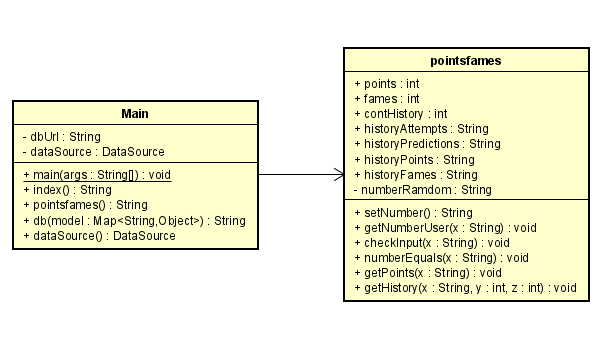
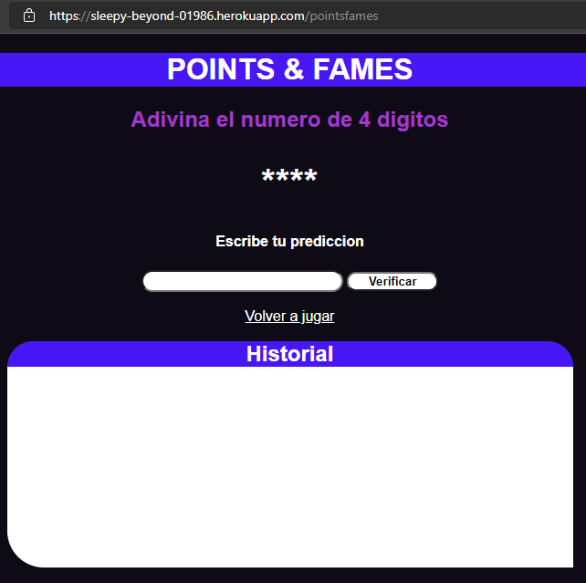
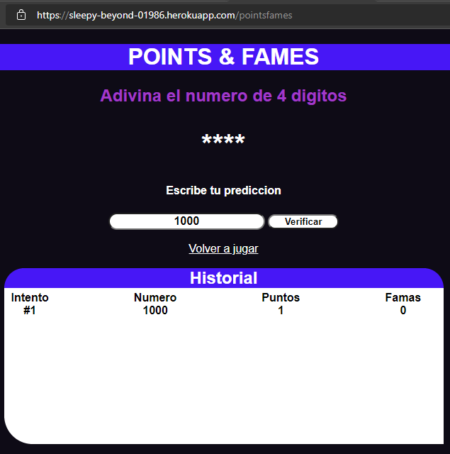
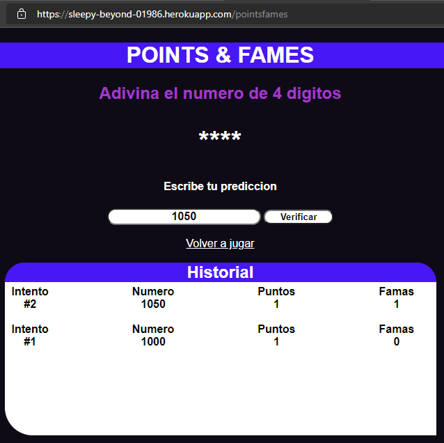
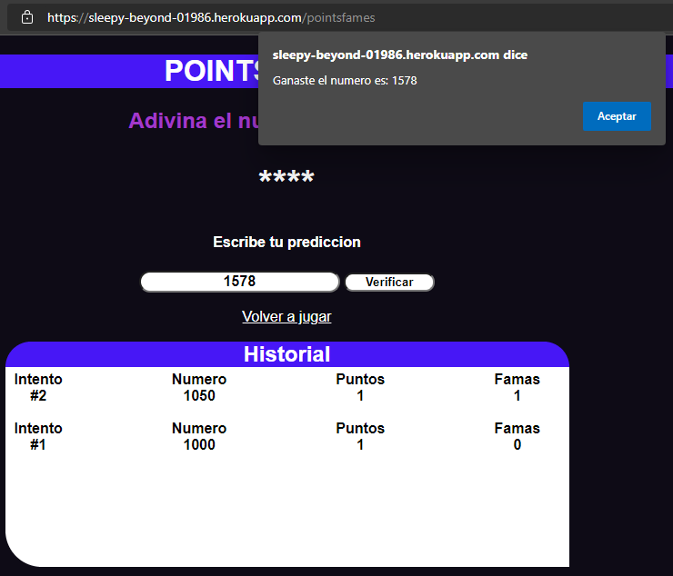
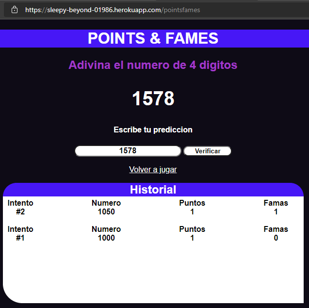
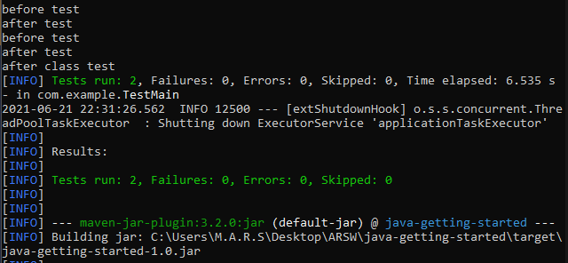

## Picas y Famas
### Miguel Ángel Rodríguez Siachoque
### 21 de Junio de 2021

## Picas y Famas - HeokuApp

## Paquete Datagram
 
#### Descripcion Main
Este programa que administra el direccionamiento de archivos html, puertos, base de datos de Heroku, etc...
> - ___pointsfames:___ Genera el espacio en Heroku para que indentifique y ejecute ___html, css y js___.
#### Descripcion PointsFames
Este programa se encarga de administrar la operación del juego de picas & famas:
> - ___setNumber:___ Genera el numero aleatorio de picas y famas.
> - ___getNumberUser:___ Obtiene el numero predccion del usuario en el Web Site.
> - ___checkInput:___ Verifica que el usuario ingresa numeros y la cantidad correcta de digitos.
> - ___numberEquals:___ Evalua si el numero que ingreso el usario es el mismo que genero el juego.
> - ___getPoints:___ Administra los puntos del juego, tanto las picas como famas.
> - ___getHistory:___ Genera un historial del usuario, donde muestra numero de intento, numero de prediccion, puntos y famas del usuario.

## Ejecucion
 
> - Se verifica que se la aplicación se encuentra en una dirección Heroku. 
 
> - Se verifica que el funcionamiento de lectura de numeros, puntos picas y del historial.
 
> - Se verifica el funcionamiento de una nueva lectura de numeros, famas y el seguimiento del historial.
 
> - Se verifica el funcionamiento de evaluar el mismo numero de usuario con el de la aplicacion.
 
> - Se verifica el funcionamiento de mostrar el verdadero numero.

## Test
 
> - 2 pruebas test y la ejecución de antes y despues de la aplicación.

## JavaDoc:
[JavaDoc - HerokuApp](JavaDoc/index.html)

## Tiempo de Lineas LOC
- ___Main:___ 
44 lineasLOC. 
- ___PointsFames:___ 
113 lineasLOC. 
### Tiempo total
___204/22 = 9.277 lineasLOC/hora.___
